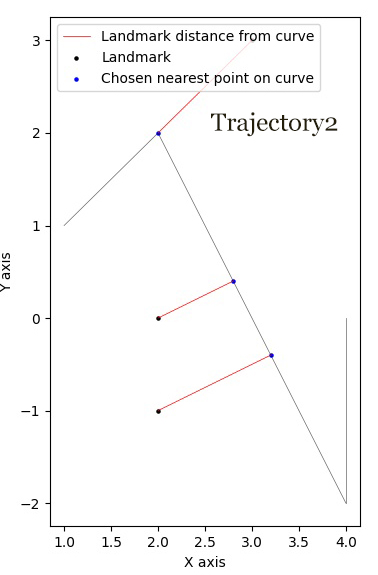
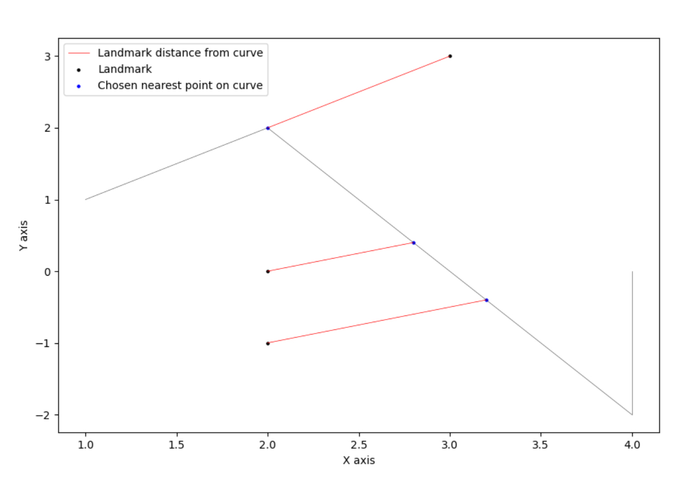
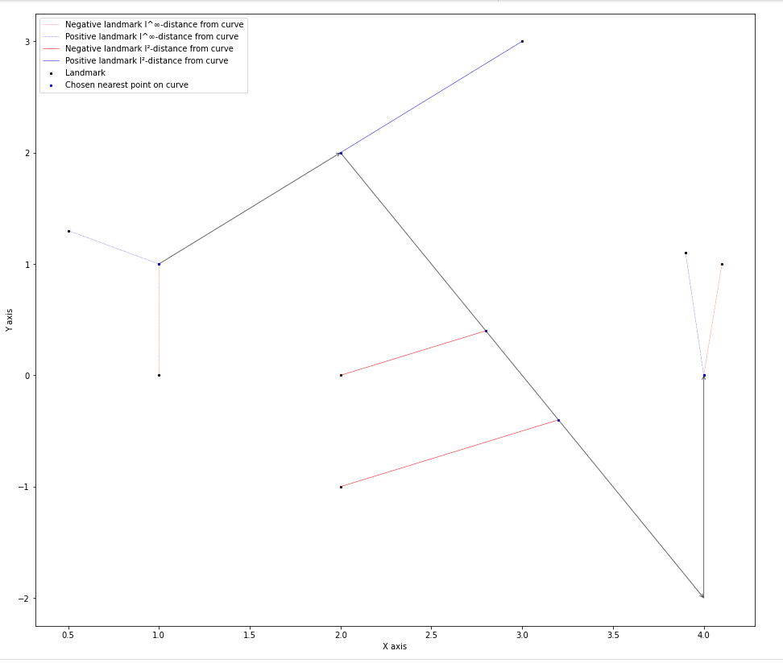
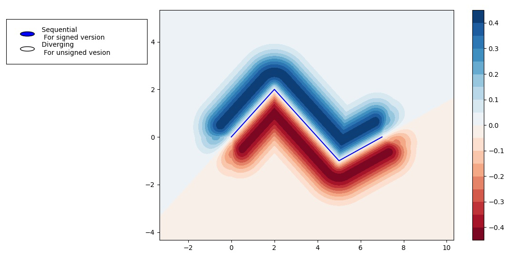

|PyPI license|   |Documentation Status|

.. |PyPI license| image:: https://img.shields.io/pypi/l/ansicolortags.svg
   :target: https://pypi.python.org/pypi/ansicolortags/

.. |Documentation Status| image:: https://readthedocs.org/projects/ansicolortags/badge/?version=latest
      :target: http://ansicolortags.readthedocs.io/?badge=latest

.. contents:: Table of Contents
  :depth: 7

  
  
Introduction
************
In this package three landmark-based distances and their 
feature mappings, introduced in [1]_, [2]_, are implemented (for more details see Overview section). Moreover, it provides
access to fundamental functions used in calculating these distances.

Overview
********
More details for understanding the functionality of the package: 

Feature mapping used in calculating d_Q
========================================

First, using a landmark set Q, an orientation-non-perserving (unsigned version) feature mapping, taken from [1]_, is provided to convert a trajectory to a vector of length \|Q|\.

Second, using a landmark set Q and a positive parameter sigma, an orientation-perserving (signed version) feature mapping, taken from [2]_, is provided to convert a trajectory to a vector of length \|Q|\  that cares about the direction of curves.

In this package these functionalities can be accessed by the implemented curve2vec function.

d_Q distance of two trajcetories
=================================
   
The d_Q distance of two trajectories is the normalized Euclidean distance between two vectorized trajectories via above feature mappings.

In this package this functionality is given by d_Q function.

d_pi_Q distance of two trajcetories
====================================
  
This is the normalized l^p-distance of the associated argmin points on trajectories obtained by landmarks Q.

In this package this is provided by d_pi_Q function.

Visualizations
===============

   
Drawing landmarks and trajectories
###################################

Visaulizing landmarks, trajectories and distances between landmarks and the given trajectory.

draw_landmarks_curve function in this package does this job.

Color-coding
#############################################################################

Visaulizing the feature mappings in terms of color-coding.

colorcoding function in this package does this job.

Curves and distance of a point from a curve
============================================

By taking the advantage of DistsBase class one can compute the followings:

1. [The minimum distance between a point and any (complicated) piecewise linear curve.]_
 
The minimum distance of a set of points from a curve simultaneously.

The minimum distance of a point/set of points from a line segment.

Also, it helps in calculating:

Closest curve from a set of curves to a given set of points by considering a cost function like the least mean square cost.

The minimum distance between a set of points and a curve. 

The signed version of all above functionalities are also available in this package, but note that this version is impelemented according to the signed feature mapping introduced in [2]_. \ 
 To get actual signed distance values (not affected by Gaussian weight in the definition of signed feature mapping in [2]_) one can use a very large sigma value (like 10000) and then multiply the output value form APntSetSignedDistACrv with the selected sigma.

All can be accessible in DistsBase class by functions APntSetDistACrv for unsigned and APntSetSignedDistACrv for signed distance.

Also, if it is needed, one can get access to implicit computation details by class structure and functionalities.

Installation
************

With pip
=========

Install using pip: 

.. code-block::

   pip install trjtrypy

With git
=========

First clone project repository:

.. code-block::

   git clone ....

Then run following command in the directory of project:

.. code-block::

   python setup.py install

Usage
*****

trjtrypy.featureMapping.curve2vec
=================================
trjtrypy.featureMapping.curve2vec(landmarks, trajectories, version='unsigned', sigma=1, segIndx=False, argMinPnts=False)

   Converts trajectories to vectors of the size of landmarks.

   * **Parameters**
         * **landmarks:  List or numpy array of shape (n, 2)** \ 
            Coordinates of landmarks in the plane.

         * **trajcetories: List or numpy array of numpy arrays** \ 
            An array of arrays consisting waypoints of trajectories.

         * **version: {'signed', 'unsigned'}, default='unsigned'** \
            Specifies the version of feature mapping.

         * **sigma: float** \
            A positive constant used when usedfm='signed'.

         * **segIndx: bool (True, False), defalt=False** \
               When segIndx=True, the function returns the indices of selected segmetns that give the minimum distance to the landmarks.   

         * **argMinPnts: bool (True, False), defalt=False** \
               When argMinPnts=True, the function returns the argmin points associated to the landmarks.   
               
   * **Returns**
         * **Numpy array** \
            An array that contains numpy array of mapped vectors under feature mapping curve2vec or distances or dictionaries when segIndx or argMinPnts are called for each trajectory.

**Remark**

   Notice that when version='signed', the trajectories passed into the function must be semi-simple (i.e., countably many self crossings are allowed).
   However, the code will be run for any trajectory but it will possibly assigne an incorrect sign to the values.

**Examples**

.. code-block:: python

   >>> import numpy as np
   >>> import trjtrypy as tt
   

.. code-block:: python

   >>> trajectory1 = np.array([[0,0], [2,2], [5,-1], [7,0]])
   >>> trajectory2 = np.array([[1,1], [2,2], [4,-2], [4,0]])
   >>> trajectories = np.array([trajectory1, trajectory2]) # or [trajectory1, trajectory2]
   >>> landmarks = np.array([[2,-1], [3,3], [2,0]]) # or [[2,-1], [3,3], [2,0]]

Default (unsigned feature mapping):

.. code-block:: python

   >>> fms = tt.featureMapping.curve2vec(landmarks, trajectories)
   >>> fms # An array containing unsigned feature mapping of trajectories
   array([[2.12132034, 1.41421356, 1.41421356],
       [1.34164079, 1.41421356, 0.89442719]])
   >>> fm[0] # Vectorized form of trajectory1 under curve2vec feature mapping
   array([2.12132034, 1.41421356, 1.41421356])
   >>> fm[1] # Vectorized form of trajectory2 under curve2vec feature mapping
   array([1.34164079, 1.41421356, 0.89442719])

When version='signed' and sigma is given:

.. code-block:: python

   >>> signfms = tt.featureMapping.curve2vec(landmarks, trajectories, version='signed', sigma=2)
   >>> signfms # An array containing signed feature mapping of trajectories
   array([[-0.34434594,  0.42888194, -0.42888194],
       [-0.42773397,  0.42888194, -0.36614752]])
   >>> signfm[0] # Vectorized form of trajectory1 under curve2vec feature mapping
   array([-0.34434594,  0.42888194, -0.42888194])
   >>> signfm[1] # Vectorized form of trajectory2 under curve2vec feature mapping
   array([-0.42773397,  0.42888194, -0.36614752])

In both signed and unsigned versions setting segIndx=True will return an array of dictionaries: 

.. code-block:: python

   >>> segindxfms = tt.featureMapping.curve2vec(landmarks, trajectories, segIndx=True)
   >>> segindxfms # See figure 1 and figure 2 
   array([{'UnsignedCurve2Vec': array([2.12132034, 1.41421356, 1.41421356]), 'SelectedSegmentsIndex': array([0, 0, 0])},
       {'UnsignedCurve2Vec': array([1.34164079, 1.41421356, 0.89442719]), 'SelectedSegmentsIndex': array([1, 0, 1])}],
      dtype=object)
   >>> segindxfms[0] # See figure 1
   {'SelectedSegmentsIndex': array([0, 0, 0]),
   'UnsignedCurve2Vec': array([2.12132034, 1.41421356, 1.41421356])}
   >>> segindxfms[0]['SelectedSegmentsIndex'] # Output determines that which segments of trajectory1 are selected by the landmarks. As an example, first landmark has selected the first segment (0 index segment) of trajectory1.
   array([0, 0, 0])
   >>> segindxfms[0]['UnsignedCurve2Vec']  # Output determines landmarks unsigned distances from trajectory1. As an example, first landmark unsigned distance from trajectory1 is 2.12132034.
   array([2.12132034, 1.41421356, 1.41421356])
   >>> segindxfms[1]
   {'SelectedSegmentsIndex': array([1, 0, 1]),
   'UnsignedCurve2Vec': array([1.34164079, 1.41421356, 0.89442719])}

Also, setting argMinPnts=True will return argmin points selected by landmarks:

.. code-block:: python

   >>> argminfms = tt.featureMapping.curve2vec(landmarks, trajectories, argMinPnts=True)
   >>> argminfms # See figure 1 and figure 2 
   array([{'UnsignedCurve2Vec': array([2.12132034, 1.41421356, 1.41421356]), 'ArgMinPoints': array([[0.5, 0.5],
       [2. , 2. ],
       [1. , 1. ]])},
       {'UnsignedCurve2Vec': array([1.34164079, 1.41421356, 0.89442719]), 'ArgMinPoints': array([[ 3.2, -0.4],
       [ 2. ,  2. ],
       [ 2.8,  0.4]])}], dtype=object)
   >>> argminfms[0] # See figure 1
   {'ArgMinPoints': array([[0.5, 0.5],
        [2. , 2. ],
        [1. , 1. ]]),
   'UnsignedCurve2Vec': array([2.12132034, 1.41421356, 1.41421356])}
   >>> argminfms[0]['ArgMinPoints'] # Output determines which points of trajectory1 are selected by the landmarks. As an example, first landmark selects the point [0.5, 0.5] on trajectory1.
   array([[0.5, 0.5],
       [2. , 2. ],
       [1. , 1. ]])
   >>> argminfms[0]['UnsignedCurve2Vec']  # Output determines landmarks unsigned distances from trajectory1. As an example, first landmark unsigned distance from trajectory1 is 2.12132034.
   array([2.12132034, 1.41421356, 1.41421356])
   >>> argminfms[1]
   {'ArgMinPoints': array([[ 3.2, -0.4],
        [ 2. ,  2. ],
        [ 2.8,  0.4]]),
   'UnsignedCurve2Vec': array([1.34164079, 1.41421356, 0.89442719])}

Figure 1:

.. image:: detailtraj1.jpg

Figure 2:

A combination of above functionalities can also be used:

.. code-block:: python

   >>> tt.featureMapping.curve2vec(landmarks, trajectories, segIndx=True, argMinPnts=True)
   array([{'UnsignedCurve2Vec': array([2.12132034, 1.41421356, 1.41421356]), 'SelectedSegmentsIndex': array([0, 0, 0]), 'ArgMinPoints': array([[0.5, 0.5],
       [2. , 2. ],
       [1. , 1. ]])},
       {'UnsignedCurve2Vec': array([1.34164079, 1.41421356, 0.89442719]), 'SelectedSegmentsIndex': array([1, 0, 1]), 'ArgMinPoints': array([[ 3.2, -0.4],
       [ 2. ,  2. ],
       [ 2.8,  0.4]])}], dtype=object)
   >>> tt.featureMapping.curve2vec(landmarks, trajectories, version='signed', sigma=0.9, segIndx=True, argMinPnts=True)
   array([{'SignedCurve2Vec': array([-0.00911206,  0.1330272 , -0.1330272 ]), 'SelectedSegmentsIndex': array([0, 0, 0]), 'ArgMinPoints': array([[0.5, 0.5],
       [2. , 2. ],
       [1. , 1. ]])},
       {'SignedCurve2Vec': array([-0.16154551,  0.1330272 , -0.3701431 ]), 'SelectedSegmentsIndex': array([1, 0, 1]), 'ArgMinPoints': array([[ 3.2, -0.4],
       [ 2. ,  2. ],
       [ 2.8,  0.4]])}], dtype=object)

trjtrypy.distances.d_Q
======================

trjtrypy.distances.d_Q(landmarks, trajectory1, trajectory2, usedfm='unsigned', sigma=1, p=2)

   Calculating d_Q distance of two trajectories.
      
   * **Parameters**
      
      * **landmarks:  List or numpy array of shape (n, 2)** \ 
                     Coordinates of landmarks in the plane.
      

      * **trajectory1: Numpy array of shape (n1, 2)** \
                      Coordinates of waypoints of trajectory1.

      * **trajectory2: Numpy array of shape (n2, 2)** \
                      Coordinates of waypoints of trajectory2.

      * **usedfm: {'signed', 'unsigned'}, default='unsigned'** \
                   Specifies the version of feature mapping.

      * **sigma: float** \
                A positive constant used when usedfm='signed'.

      * **p: float, defalt=2** \
             Specifies the used p-norm (1 <= p<= ∞).
   
   * **Returns**
            * **float** \
               Distance between two trajectories based on Q, sigma and p.

**Examples**

.. code-block:: python

   >>> import numpy as np
   >>> import trjtrypy as tt
   

.. code-block:: python

   >>> trajectory1 = np.array([[0,0], [2,2], [5,-1], [7,0]])
   >>> trajectory2 = np.array([[1,1], [2,2], [4,-2], [4,0]])
   >>> trajectories = np.array([trajectory1, trajectory2]) # or [trajectory1, trajectory2]
   >>> landmarks = np.array([[2,-1], [3,3], [2,0]]) # or [[2,-1], [3,3], [2,0]]

.. code-block:: python

   >>> tt.distances.d_Q(landmarks, trajectory1, trajectory2)
   0.5410108081367118
   >>> tt.distances.d_Q(landmarks, trajectory1, trajectory2, p=5) # Using 5-norm to calculate distacne of two trajcetories.
   0.641559854784373
   >>> tt.distances.d_Q(landmarks, trajectory1, trajectory2, usedfm='signed', sigma=0.1) # Using signed version of the feature mapping in computation (sigma is needed in this version).
   9.320212490006313e-35
   >>> tt.distances.d_Q(landmarks, trajectory1, trajectory2, usedfm='signed', sigma=0.1, p=float('inf')) # Using infinity-norm for calculating distacne of two trajectories.
   1.614308157002897e-34

trjtrypy.distances.d_pi_Q
=========================

trjtrypy.distances.d_pi_Q(landmarks, trajectory1, trajectory2, p=1)

   Calculating d_pi_Q distance between two trajectories.

   * **Parameters**
         
      * **landmarks:  List or numpy array of shape (n, 2)** \ 
         Coordinates of landmarks in the plane.

      * **trajectory1: Numpy array of shape (n1, 2)** \
         Coordinates of waypoints of trajectory1.

      * **trajectory2: Numpy array of shape (n2, 2)** \
         Coordinates of waypoints of trajectory2.

      * **p: float, defalt=2** \
         Specifies the used p-norm (1 <= p<= ∞).

   * **Returns**

     * **float** \
         Distance between two trajectories based on Q and p.

**Examples**

.. code-block:: python

   >>> import numpy as np
   >>> import trjtrypy as tt
   

.. code-block:: python

   >>> trajectory1 = np.array([[0,0], [2,2], [5,-1], [7,0]])
   >>> trajectory2 = np.array([[1,1], [2,2], [4,-2], [4,0]])
   >>> trajectories = np.array([trajectory1, trajectory2]) # or [trajectory1, trajectory2]
   >>> landmarks = np.array([[2,-1], [3,3], [2,0]]) # or [[2,-1], [3,3], [2,0]]

.. code-block:: python

   >>> tt.distances.d_pi_Q(landmarks, trajectory1, trajectory2)
   1.5811388300841898
   

trjtrypy.visualizations.draw_landmarks_trajectory
=================================================

trjtrpy.visualizations.draw_landmarks_trajectory(landmarks, trajectory, version='unsigned', crv=True, lndmarks=True, dists=True, distpnts=True, zoom=None, fgsize=(10,10))

   Draws trajectory and landmarks.

   * **Parameters**
      
      * **landmarks:  List or numpy array of shape (n, 2)** \ 
         Coordinates of landmarks in the plane.
      * **trajectory: Numpy array of shape (m, 2)** \
         Coordinates of waypoints of trajectory.
      * **version: {'signed', 'unsigned'}, default='unsigned'** \
         Specifies the version of the feature mapping.
      * **crv: bool (True, False), default='True'** \
           When crv=False, the function will not draw the trajcetory.
      * **lndmarks: bool (True, False), default='True'** \
           When lndmarks=False, the function will not draw the landmarks.
      * **dists: bool (True, False), default = 'True'** \
           When dists=False, the function will not draw distances.
      * **distpnts: bool (True, False), default='True'** \
           When distpnts=False, the function will not draw argmin points.
      * **zoom: float, default=None** \
           Zoom out/in in a fixed figure size.
      * **fgsize: tuple of integers, default=(10, 10)** \
            Specifies width and height of the figure size.
            
   * **Returns** 
            A figure that contains landmarks, trajectory and other selected options by the user.

**Examples**

.. code-block:: python

   >>> import numpy as np
   >>> import trjtrypy as tt
   

.. code-block:: python

   >>> trajectory1 = np.array([[0,0], [2,2], [5,-1], [7,0]])
   >>> trajectory2 = np.array([[1,1], [2,2], [4,-2], [4,0]])
   >>> trajectories = np.array([trajectory1, trajectory2]) # [trajectory1, trajectory2]
   >>> landmarks = np.array([[1,0], [.5,1.3], [2,-1], [3,3], [2,0], [4.1,1], [3.90,1.1]]) # or [[1,0], [.5,1.3], [2,-1], [3,3], [2,0], [4.1,1], [3.90,1.1]]

.. code-block:: python

   >>> tt.visualizations.draw_landmarks_curve(landmarks,trajectory2,version='unsigned',crv=True,lndmarks=True,dists=True,distpnts=True,zoom=None,fgsize=(10,10))
   

In signed version the trajectory will be drawn in a directed form. As mentioned in reference distances in end points of the trajectory is not 2-norm, so those distances are shown by dotted line segments in visualization:

.. code-block:: python

   >>>  tt.visualizations.draw_landmarks_curve(landmarks,curve,version='signed',crv=True,lndmarks=True,dists=True,distpnts=True,zoom=None,fgsize=(10,10))
   

trjtrypy.visualizations.colorcoding
===================================

trjtrypy.visualizations.colorcoding(vectorizedfunc, trajectory, zoom=None, dpi=50, fgsize=(10,10))

   Color code the feature mapping functions.
   
   * **Parameters**

      * **vectorizedfunc: vectorized function** \
         Vectorized feature mapping function.
      * **trajectory: Numpy array of shape (m, 2)** \
         Coordinates of waypoints of trajectory.
      * **zoom: float, default=None** \
         Zoom out/in in a fixed figure size.
      * **dpi: int, default=50** \
         Specifies the resolution of the figure.
      * **fgsize: tuple of integers, default=(10, 10)** \
         Specifies width and height of the figure.
   * **Returns**   
         The color-coded visualization of the specified feature mapping.

**Examples**

Color-coding of the unsigned version of the feature mappping:

.. code-block:: python

   import numpy as np
   import trjtrypy as tt

   trajectory=np.array([[0,0], [2,2], [5,-1], [7,0]]) # or [[0,0], [2,2], [5,-1], [7,0]]
   # define the feature mapping function as follows:
   def fmfunc(x,y): 
      return tt.featureMappings.curve2vec([[x,y]], [trajectory])[0]
   # vectorize above function with numpy vectorize function
   fmfunc=np.vectorize(fmfunc)
   # color-code
   colorcoding(fmfunc, trajectory) # figure 3

Figure 3:
(With radio buttons one can choose the type of colormap)

.. image:: colorcodeunsigned.jpg
   :width: 600px
   :height: 300px     

Color-coding of the signed version of the feature mappping:

.. code-block:: python

   import numpy as np
   import trjtrypy as tt

   trajectory=np.array([[0,0], [2,2], [5,-1], [7,0]]) # or [[0,0], [2,2], [5,-1], [7,0]]
   # define the feature mapping function as follows:
   def fmfunc(x,y): 
      return tt.featureMappings.curve2vec([[x,y]], [trajectory], version='signed')[0]
   # vectorize above function with numpy vectorize function
   fmfunc=np.vectorize(fmfunc)
   # color-code
   colorcoding(fmfunc, trajectory) # figure 4

Figure 4:

trjtrypy.distsbase
==================

This class provide facilities for followings:

signed/unsigned distance of a point from a line segment.

.. code-block:: python

   import numpy as np
   from trjtrypy.distsbase import DistsBase

   

   
   # create an object from DistsBase class
   d = DistsBase()

   

   # for calcullating each of followings:
   # 1. signed distance of a point from a line segment.
   # 2. signed distance of a set of points from a line segment.
   # 3. signed distance of set of point from a piece-wise linear curve.
   #
   #
   # For first one, one can suppose a point like point = [[x1,y1]] and a line segment like 
   # linesegment = np.array( [ [x of start of line segment, y of start of line segment ],[x of end of line segment, y of end of line segment] ] )
   # then by using d.APntSetDistACrv(point, linesegment), distance (unsigned distance) of point from the line segment will be computed
   # and d.APntSetSignedDistACrv(point, linesegment) give signed distance, means it computes distance and ascertains position of point respect to line segment.
   #
   #
   # For second, suppose a set of point like points = [[x1,y1], [x2,y2], [x3,y3], [x4,y4]] and a line segment like 
   # linesegment = np.array( [ [x of start of line segment, y of start of line segment ],[x of end of line segment, y of end of line segment] ] )
   # then by using d.APntSetDistACrv(points, linesegment), distance (unsigned distance) of points from the line segment will be computed
   # and d.APntSetSignedDistACrv(points, linesegment) give signed distances, means it computes distance and ascertains position of each point respect to line segment.
   #
   # For third, consider following example:
   
   points = [[2,-1], [3,3], [2,0]]
   
   curve1 = np.array([[0,0], [2,2], [5,-1], [7,0]])

   d.APntSetDistACrv(points, curve1) # array([2.12132034, 1.41421356, 1.41421356])

   d.APntSetDistACrv(points, curve1, InUse=True) # In this option, fucntion returns above resualt and maintain respected computation details
   
   d.APntSetDistACrv(points, curve1) # array([-0.02356574,  0.19139299, -0.19139299])

Further applications
********************

Application for curves
======================
One can approximate any continues function via trajectories with a sufficent accuracy
and then apply this package functionalities for curves.

Application for two dimentional times series
============================================
By connecting consecutive points in a 2d times series one can make a trajectory in order 
to use this package functionalities.

References
**********

.. [1]  Jeff M. Phillips and Pingfan Tang. Simple distances for trajectories via landmarks. In ACM GIS SIGSPATIAL, 2019.
         https://dl.acm.org/doi/pdf/10.1145/3347146.3359098

.. [2]  Jeff M. Phillips and Hasan Pourmahmood-Aghababa. Orientation-Preserving Vectorized Distance Between Curves. MSML21, August 2021.
         https://arxiv.org/pdf/2007.15924

Citation
********

If you found this package or information helpful, please cite above references.

