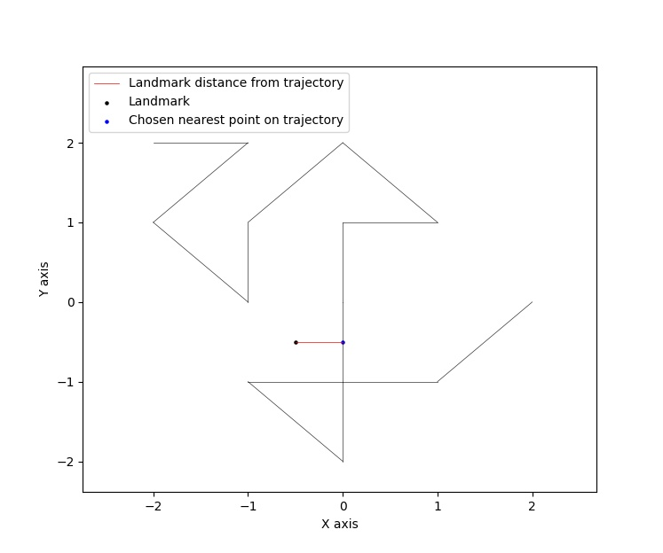
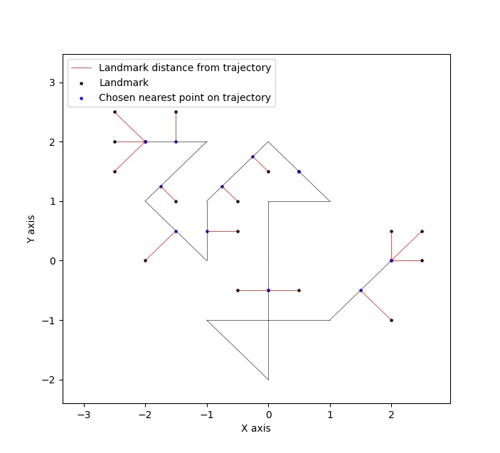
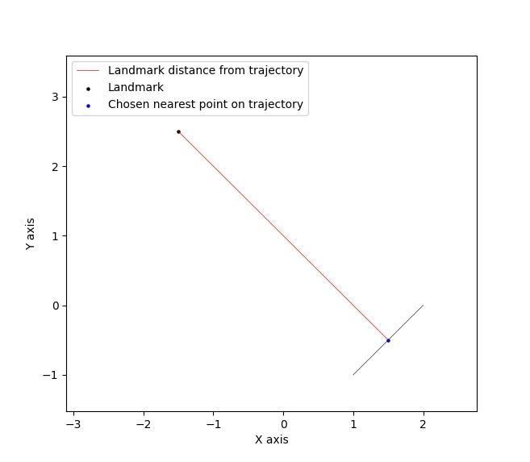
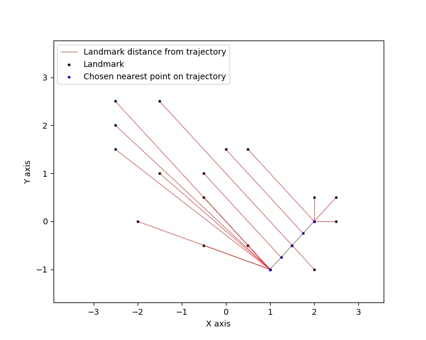

|PyPI license|   |Documentation Status|

.. |PyPI license| image:: https://img.shields.io/pypi/l/ansicolortags.svg
   :target: https://pypi.python.org/pypi/ansicolortags/

.. |Documentation Status| image:: https://readthedocs.org/projects/ansicolortags/badge/?version=latest
      :target: http://ansicolortags.readthedocs.io/?badge=latest

.. contents:: Table of Contents
  :depth: 7

  
  
Introduction
************
In this package three landmark-based distances and their 
feature mappings, introduced in [1]_, [2]_, are implemented (for more details see Overview section). Moreover, it provides
access to fundamental functions used in calculating these distances.

Overview
********
More details for understanding the functionality of the package: 

1. Feature mapping used in calculating d_Q
==========================================

First, using a landmark set Q, an orientation-non-perserving (unsigned version) feature mapping, taken from [1]_, is provided to convert a trajectory to a vector of length \|Q|\.

Second, using a landmark set Q and a positive parameter sigma, an orientation-perserving (signed version) feature mapping, taken from [2]_, is provided to convert a trajectory to a vector of length \|Q|\  that cares about the direction of curves.

In this package these functionalities can be accessed by the implemented curve2vec function.

2. d_Q distance of two trajcetories
===================================
   
The d_Q distance of two trajectories is the normalized Euclidean distance between two vectorized trajectories via above feature mappings.

In this package this functionality is given by d_Q function.

3. d_pi_Q distance of two trajcetories
=======================================
  
This is the normalized l^p-distance of the associated argmin points on trajectories obtained by landmarks Q.

In this package this is provided by d_pi_Q function.

4. Visualizations
=================

   
4.1. Drawing landmarks and trajectories
#######################################

Visaulizing landmarks, trajectories and distances between landmarks and the given trajectory.

draw_landmarks_curve function in this package does this job.

4.2. Color-coding
#################

Visaulizing the feature mappings in terms of color-coding.

colorcoding function in this package does this job.

5. Curves and points distances
==============================

By taking the advantage of DistsBase class one can compute the followings:

5.1. `The minimum distance between a point and any (complicated) piecewise linear curve.`
#########################################################################################

Usage: [i]_

Example: 

(figure was drawn by *draw_landmarks_trajectory* function of this package)

5.2. `The minimum distance of a set of points from a curve simultaneously.`
###########################################################################

Usage: [ii]_

Example: 

(figure was drawn by *draw_landmarks_trajectory* function of this package)

5.3. `The minimum distance of a point/set of points from a line segment.`
#########################################################################

Usage: [iii]_

Examples: 

(figures were drawn by *draw_landmarks_trajectory* function of this package)

Also, this class helps in calculating:

5.4. `Closest curve from a set of curves to a given set of points.`
###################################################################

This is achievable by considering a cost function like the least mean square cost.

5.5. The minimum distance between a set of points and a curve.
##############################################################

This is not equivelent to the part 5.2 But one can do as part 5.2 then take minimum.

**The signed version of all above functionalities are also available in this class, but note that this version is impelemented according to the signed feature mapping introduced in** [2]_. \ 
**To get actual signed distance values (not affected by Gaussian weight in the definition of signed feature mapping in** [2]_ **) one can use a very large sigma value (like 10000) and then multiply the output value form APntSetSignedDistACrv with the selected sigma.**

Installation
************

**Requirments**

**With pip**

Install using pip: 

.. code-block::

   pip install trjtrypy

**With git**

First clone the project repository:

.. code-block::

   git clone ....

Then run the following command in the directory of the project:

.. code-block::

   python setup.py install

Usage
*****

trjtrypy.featureMapping.curve2vec
=================================
trjtrypy.featureMapping.curve2vec(landmarks, trajectories, version='unsigned', sigma=1, segIndx=False, argMinPnts=False)

   Converts trajectories to vectors of the size of landmarks.

   * **Parameters**
         * **landmarks:  List or numpy array of shape (n, 2)** \ 
            Coordinates of landmarks in the plane.

         * **trajcetories: List or numpy array of numpy arrays** \ 
            An array of arrays consisting waypoints of trajectories.

         * **version: {'signed', 'unsigned'}, default='unsigned'** \
            Specifies the version of feature mapping.

         * **sigma: float** \
            A positive constant used when usedfm='signed'.

         * **segIndx: bool (True, False), defalt=False** \
               When segIndx=True, the function returns the indices of selected segmetns that give the minimum distance to the landmarks.   

         * **argMinPnts: bool (True, False), defalt=False** \
               When argMinPnts=True, the function returns the argmin points associated to the landmarks.   
               
   * **Returns**
         * **Numpy array** \
            An array that contains numpy array of mapped vectors under feature mapping curve2vec or distances or dictionaries when segIndx or argMinPnts are called for each trajectory.

**Remark**

   Notice that when version='signed', the trajectories passed into the function must be semi-simple (i.e., countably many self crossings are allowed).
   However, the code will be run for any trajectory but it will possibly assigne an incorrect sign to the values.

**Examples**

.. code-block:: python

   >>> import numpy as np
   >>> import trjtrypy as tt
   

.. code-block:: python

   >>> trajectory1 = np.array([[0,0], [2,2], [5,-1], [7,0]])
   >>> trajectory2 = np.array([[-2,2], [-1,2], [-2,1], [-1,0], [-1,1], [0,2], [1,1], [0,1], [0,0], [0,-1], [0,-2], [-1,-1], [1,-1], [2,0]])
   >>> trajectories = np.array([trajectory1, trajectory2]) # or [trajectory1, trajectory2]
   >>> landmarks = np.array([[2,-1], [3,3], [2,0]]) # or [[2,-1], [3,3], [2,0]]

Default (unsigned feature mapping):

.. code-block:: python

   >>> fms = tt.featureMapping.curve2vec(landmarks, trajectories)
   >>> fms # An array containing unsigned feature mapping of trajectories
   array([[2.12132034e+00, 1.41421356e+00, 1.41421356e+00],
       [7.07106781e-01, 2.82842712e+00, 3.14018492e-16]])
   >>> fm[0] # Vectorized form of trajectory1 under curve2vec feature mapping
   array([2.12132034e+00, 1.41421356e+00, 1.41421356e+00])
   >>> fm[1] # Vectorized form of trajectory2 under curve2vec feature mapping
   array([7.07106781e-01, 2.82842712e+00, 3.14018492e-16])

When ``version='signed'`` and sigma is given:

.. code-block:: python

   >>> signfms = tt.featureMapping.curve2vec(landmarks, trajectories, version='signed', sigma=2)
   >>> signfms # An array containing signed feature mapping of trajectories
   array([[-3.44345942e-01,  4.28881942e-01, -4.28881942e-01],
       [-3.12009772e-01,  1.91392993e-01, -1.57009246e-16]])
   >>> signfm[0] # Vectorized form of trajectory1 under curve2vec feature mapping
   array([-3.44345942e-01,  4.28881942e-01, -4.28881942e-01])
   >>> signfm[1] # Vectorized form of trajectory2 under curve2vec feature mapping
   array([-3.12009772e-01,  1.91392993e-01, -1.57009246e-16])

In both signed and unsigned versions setting ``segIndx=True`` will return an array of dictionaries: 

.. code-block:: python

   >>> segindxfms = tt.featureMapping.curve2vec(landmarks, trajectories, segIndx=True)
   >>> segindxfms # See figure 1 and figure 2 
   array([{'UnsignedCurve2Vec': array([2.12132034, 1.41421356, 1.41421356]), 'SelectedSegmentsIndex': array([0, 0, 0], dtype=int64)},
       {'UnsignedCurve2Vec': array([7.07106781e-01, 2.82842712e+00, 3.14018492e-16]), 'SelectedSegmentsIndex': array([12,  5, 12], dtype=int64)}],
      dtype=object)
   >>> segindxfms[0] # See figure 1
   {'SelectedSegmentsIndex': array([0, 0, 0]),
   'UnsignedCurve2Vec': array([2.12132034, 1.41421356, 1.41421356])}
   >>> segindxfms[0]['SelectedSegmentsIndex'] # Output determines that which segments of trajectory1 are selected by the landmarks. As an example, first landmark has selected the first segment (0 index segment) of trajectory1.
   array([0, 0, 0])
   >>> segindxfms[0]['UnsignedCurve2Vec']  # Output determines landmarks unsigned distances from trajectory1. As an example, first landmark unsigned distance from trajectory1 is 2.12132034.
   array([2.12132034, 1.41421356, 1.41421356])
   >>> segindxfms[1]
   {'UnsignedCurve2Vec': array([7.07106781e-01, 2.82842712e+00, 3.14018492e-16]), 'SelectedSegmentsIndex': array([12,  5, 12], dtype=int64)}

Also, setting ``argMinPnts=True`` will return argmin points selected by landmarks:

.. code-block:: python

   >>> argminfms = tt.featureMapping.curve2vec(landmarks, trajectories, argMinPnts=True)
   >>> argminfms # See figure 1 and figure 2 
   array([{'UnsignedCurve2Vec': array([2.12132034, 1.41421356, 1.41421356]), 'ArgMinPoints': array([[0.5, 0.5],
       [2. , 2. ],
       [1. , 1. ]])},
       {'UnsignedCurve2Vec': array([7.07106781e-01, 2.82842712e+00, 3.14018492e-16]), 'ArgMinPoints': array([[ 1.50000000e+00, -5.00000000e-01],
       [ 1.00000000e+00,  1.00000000e+00],
       [ 2.00000000e+00, -2.22044605e-16]])}], dtype=object)
   >>> argminfms[0] # See figure 1
   {'ArgMinPoints': array([[0.5, 0.5],
        [2. , 2. ],
        [1. , 1. ]]),
   'UnsignedCurve2Vec': array([2.12132034, 1.41421356, 1.41421356])}
   >>> argminfms[0]['ArgMinPoints'] # Output determines which points of trajectory1 are selected by the landmarks. As an example, first landmark selects the point [0.5, 0.5] on trajectory1.
   array([[0.5, 0.5],
       [2. , 2. ],
       [1. , 1. ]])
   >>> argminfms[0]['UnsignedCurve2Vec']  # Output determines landmarks unsigned distances from trajectory1. As an example, first landmark unsigned distance from trajectory1 is 2.12132034.
   array([2.12132034, 1.41421356, 1.41421356])
   >>> argminfms[1]
   {'UnsignedCurve2Vec': array([7.07106781e-01, 2.82842712e+00, 3.14018492e-16]), 'ArgMinPoints': array([[ 1.50000000e+00, -5.00000000e-01],
       [ 1.00000000e+00,  1.00000000e+00],
       [ 2.00000000e+00, -2.22044605e-16]])}

Figure 1:

.. image:: detailtraj1.jpg

Figure 2:

.. image:: detailtraj2.jpg

A combination of above functionalities can also be used:

.. code-block:: python

   >>> tt.featureMapping.curve2vec(landmarks, trajectories, segIndx=True, argMinPnts=True)
   array([{'UnsignedCurve2Vec': array([2.12132034, 1.41421356, 1.41421356]), 'SelectedSegmentsIndex': array([0, 0, 0], dtype=int64), 'ArgMinPoints': array([[0.5, 0.5],
       [2. , 2. ],
       [1. , 1. ]])},
       {'UnsignedCurve2Vec': array([7.07106781e-01, 2.82842712e+00, 3.14018492e-16]), 'SelectedSegmentsIndex': array([12,  5, 12], dtype=int64), 'ArgMinPoints': array([[ 1.50000000e+00, -5.00000000e-01],
       [ 1.00000000e+00,  1.00000000e+00],
       [ 2.00000000e+00, -2.22044605e-16]])}], dtype=object)
   >>> tt.featureMapping.curve2vec(landmarks, trajectories, version='signed', sigma=0.9, segIndx=True, argMinPnts=True)
   array([{'SignedCurve2Vec': array([-0.00911206,  0.1330272 , -0.1330272 ]), 'SelectedSegmentsIndex': array([0, 0, 0], dtype=int64), 'ArgMinPoints': array([[0.5, 0.5],
       [2. , 2. ],
       [1. , 1. ]])},
       {'SignedCurve2Vec': array([-4.23798562e-01,  1.61426291e-04, -3.48909435e-16]), 'SelectedSegmentsIndex': array([12,  5, 12], dtype=int64), 'ArgMinPoints': array([[ 1.50000000e+00, -5.00000000e-01],
       [ 1.00000000e+00,  1.00000000e+00],
       [ 2.00000000e+00, -2.22044605e-16]])}], dtype=object)

trjtrypy.distances.d_Q
======================

trjtrypy.distances.d_Q(landmarks, trajectory1, trajectory2, usedfm='unsigned', sigma=1, p=2)

   Calculating d_Q distance of two trajectories.
      
   * **Parameters**
      * **landmarks:  List or numpy array of shape (n, 2)** \ 
                     Coordinates of landmarks in the plane.
      

      * **trajectory1: Numpy array of shape (n1, 2)** \
                      Coordinates of waypoints of trajectory1.

      * **trajectory2: Numpy array of shape (n2, 2)** \
                      Coordinates of waypoints of trajectory2.

      * **usedfm: {'signed', 'unsigned'}, default='unsigned'** \
                   Specifies the version of feature mapping.

      * **sigma: float** \
                A positive constant used when usedfm='signed'.

      * **p: float, defalt=2** \
             Specifies the used p-norm (1 <= p<= ∞).
   
   * **Returns**
            * **float** \
               Distance between two trajectories based on Q, sigma and p.

**Examples**

.. code-block:: python

   >>> import numpy as np
   >>> import trjtrypy as tt
   

.. code-block:: python

   >>> trajectory1 = np.array([[0,0], [2,2], [5,-1], [7,0]])
   >>> trajectory2 = np.array([[1,1], [2,2], [4,-2], [4,0]])
   >>> trajectories = np.array([trajectory1, trajectory2]) # or [trajectory1, trajectory2]
   >>> landmarks = np.array([[2,-1], [3,3], [2,0]]) # or [[2,-1], [3,3], [2,0]]

.. code-block:: python

   >>> tt.distances.d_Q(landmarks, trajectory1, trajectory2)
   0.5410108081367118
   >>> tt.distances.d_Q(landmarks, trajectory1, trajectory2, p=5) # Using 5-norm to calculate distacne of two trajcetories.
   0.641559854784373
   >>> tt.distances.d_Q(landmarks, trajectory1, trajectory2, usedfm='signed', sigma=0.1) # Using signed version of the feature mapping in computation (sigma is needed in this version).
   9.320212490006313e-35
   >>> tt.distances.d_Q(landmarks, trajectory1, trajectory2, usedfm='signed', sigma=0.1, p=float('inf')) # Using infinity-norm for calculating distacne of two trajectories.
   1.614308157002897e-34

trjtrypy.distances.d_pi_Q
=========================

trjtrypy.distances.d_pi_Q(landmarks, trajectory1, trajectory2, p=1)

   Calculating d_pi_Q distance between two trajectories.

   * **Parameters**
      * **landmarks:  List or numpy array of shape (n, 2)** \ 
         Coordinates of landmarks in the plane.

      * **trajectory1: Numpy array of shape (n1, 2)** \
         Coordinates of waypoints of trajectory1.

      * **trajectory2: Numpy array of shape (n2, 2)** \
         Coordinates of waypoints of trajectory2.

      * **p: float, defalt=2** \
         Specifies the used p-norm (1 <= p<= ∞).

   * **Returns**

     * **float** \
         Distance between two trajectories based on Q and p.

**Examples**

.. code-block:: python

   >>> import numpy as np
   >>> import trjtrypy as tt
   

.. code-block:: python

   >>> trajectory1 = np.array([[0,0], [2,2], [5,-1], [7,0]])
   >>> trajectory2 = np.array([[1,1], [2,2], [4,-2], [4,0]])
   >>> trajectories = np.array([trajectory1, trajectory2]) # or [trajectory1, trajectory2]
   >>> landmarks = np.array([[2,-1], [3,3], [2,0]]) # or [[2,-1], [3,3], [2,0]]

.. code-block:: python

   >>> tt.distances.d_pi_Q(landmarks, trajectory1, trajectory2)
   1.5811388300841898
   

trjtrypy.visualizations.draw_landmarks_trajectory
=================================================

trjtrpy.visualizations.draw_landmarks_trajectory(landmarks, trajectory, version='unsigned', trj=True, lndmarks=True, dists=True, argminpnts=True, zoom=None, figsize=(10,10))

   Draws trajectory and landmarks.

   * **Parameters**
      * **landmarks:  List or numpy array of shape (n, 2)** \ 
         Coordinates of landmarks in the plane.
      * **trajectory: Numpy array of shape (m, 2)** \
         Coordinates of waypoints of trajectory.
      * **version: {'signed', 'unsigned'}, default='unsigned'** \
         Specifies the version of the feature mapping.
      * **trj: bool (True, False), default='True'** \
           When trj=False, the function will not draw the trajcetory.
      * **lndmarks: bool (True, False), default='True'** \
           When lndmarks=False, the function will not draw the landmarks.
      * **dists: bool (True, False), default = 'True'** \
           When dists=False, the function will not draw distances.
      * **argminpnts: bool (True, False), default='True'** \
           When argminpnts=False, the function will not draw argmin points.
      * **zoom: float, default=None** \
           Zoom out/in in a fixed figure size.
      * **figsize: tuple of integers, default=(10, 10)** \
            Specifies width and height of the figure size.
            
   * **Returns** 
            A figure that contains landmarks, trajectory and other selected options by the user.

**Examples**

.. code-block:: python

   >>> import numpy as np
   >>> import trjtrypy as tt
   

.. code-block:: python

   >>> trajectory = np.array([[-2,2], [-1,2], [-2,1], [-1,0], [-1,1], [0,2], [1,1], [0,1], [0,0], [0,-1], [0,-2], [-1,-1], [1,-1], [2,0]])
   >>> landmarks = np.array([[-2.5,1.5], [-2.5,2], [-2.5,2.5], [-2,0], [-1.5,1], [-1.5,2.5], [-0.5,-0.5], [-0.5,0.5], [-0.5,1], [0,1.5], [0.5,-0.5], [0.5,1.5], [2,-1], [2,0.5], [2.5,0], [2.5,0.5]]) # or [[-2.5,1.5], [-2.5,2], [-2.5,2.5], [-2,0], [-1.5,1], [-1.5,2.5], [-0.5,-0.5], [-0.5,0.5], [-0.5,1], [0,1.5], [0.5,-0.5], [0.5,1.5], [2,-1], [2,0.5], [2.5,0], [2.5,0.5]]

.. code-block:: python

   >>> tt.visualizations.draw_landmarks_trajectory(landmarks,trajectory,version='unsigned',trj=True,lndmarks=True,dists=True,argminpnts=True,zoom=None,figsize=(5,10))
   
.. image:: traj2.jpg
        :width: 600px
        :height: 500px

In signed version the trajectory will be drawn in a directed form. As mentioned in reference distances in end points of the trajectory is not 2-norm, so those distances are shown by dotted line segments in visualization:

.. code-block:: python

   >>>  tt.visualizations.draw_landmarks_trajectory(landmarks,trajectory,version='signed',trj=True,lndmarks=True,dists=True,argminpnts=True,zoom=None,figsize=(10,10))
   
.. image:: traj2direct.jpg
  :width: 600px
  :height: 500px        

trjtrypy.visualizations.colorcoding
===================================

trjtrypy.visualizations.colorcoding(vectorizedfunc, trajectory, zoom=None, dpi=50, figsize=(10,10))

   Color code the feature mapping functions.
   
   * **Parameters**
      * **vectorizedfunc: vectorized function** \
         Vectorized feature mapping function.
      * **trajectory: Numpy array of shape (m, 2)** \
         Coordinates of waypoints of trajectory.
      * **zoom: float, default=None** \
         Zoom out/in in a fixed figure size.
      * **dpi: int, default=50** \
         Specifies the resolution of the figure.
      * **figsize: tuple of integers, default=(10, 10)** \
         Specifies width and height of the figure.
   * **Returns**   
         The color-coded visualization of the specified feature mapping.

**Examples**

Color-coding of the unsigned version of the feature mappping:

.. code-block:: python

   import numpy as np
   import trjtrypy as tt

   trajectory=np.array([[0,0], [2,2], [5,-1], [7,0]]) # or [[0,0], [2,2], [5,-1], [7,0]]
   # define the feature mapping function as follows:
   def fmfunc(x,y): 
      return tt.featureMappings.curve2vec([[x,y]], [trajectory])[0]
   # vectorize above function with numpy vectorize function
   fmfunc=np.vectorize(fmfunc)
   # color-code
   colorcoding(fmfunc, trajectory) # figure 3

Figure 3:
(With radio buttons one can choose the type of colormap)

.. image:: colorcodeunsigned.jpg
   :width: 600px
   :height: 300px     

Color-coding of the signed version of the feature mappping:

.. code-block:: python

   import numpy as np
   import trjtrypy as tt

   trajectory=np.array([[0,0], [2,2], [5,-1], [7,0]]) # or [[0,0], [2,2], [5,-1], [7,0]]
   # define the feature mapping function as follows:
   def fmfunc(x,y): 
      return tt.featureMappings.curve2vec([[x,y]], [trajectory], version='signed')[0]
   # vectorize above function with numpy vectorize function
   fmfunc=np.vectorize(fmfunc)
   # color-code
   colorcoding(fmfunc, trajectory) # figure 4

Figure 4:

.. image:: colorcodesigned.jpg
   :width: 600px
   :height: 300px

trjtrypy.distsbase.DistsBase
============================

.. [i] The minimum distance between a point and any (complicated) piecewise linear curve:

.. code-block:: python

   import numpy as np
   from trjtrypy.distsbase import DistsBase

   # define a point
   apoint=np.array([[-0.5, -0.5]])
   # define a curve
   curve=np.array([[-2,2], [-1,2], [-2,1], [-1,0], [-1,1], [0,2], [1,1], [0,1], [0,0], [0,-1], [0,-2], [-1,-1], [1,-1], [2,0]])

   d=DistsBase()
   d.APntSetDistACrv(apoint, curve) # returns array([0.5])
   

.. [ii] The minimum distance of a set of points from a curve simultaneously:

.. code-block:: python

   import numpy as np
   from trjtrypy.distsbase import DistsBase

   # define a set of points
   setpoints=np.array([[-2.5,1.5], [-2.5,2], [-2.5,2.5], [-2,0], [-1.5,1], [-1.5,2.5], [-0.5,-0.5], [-0.5,0.5], [-0.5,1], [0,1.5], [0.5,-0.5], [0.5,1.5], [2,-1], [2,0.5], [2.5,0], [2.5,0.5]])
   # define a curve
   curve=np.array([[-2,2], [-1,2], [-2,1], [-1,0], [-1,1], [0,2], [1,1], [0,1], [0,0], [0,-1], [0,-2], [-1,-1], [1,-1], [2,0]])

   d=DistsBase()
   d.APntSetDistACrv(setpoints, curve) # returns array([7.07106781e-01, 5.00000000e-01, 7.07106781e-01, 7.07106781e-01,
                                       #                3.53553391e-01, 5.00000000e-01, 5.00000000e-01, 5.00000000e-01,
                                       #                3.53553391e-01, 3.53553391e-01, 5.00000000e-01, 1.57009246e-16,
                                       #                7.07106781e-01, 5.00000000e-01, 5.00000000e-01, 7.07106781e-01])

.. [iii] The minimum distance of a point/set of points from a line segment:

.. code-block:: python

   import numpy as np
   from trjtrypy.distsbase import DistsBase

   # define a point
   apoint=np.array([[-0.5, -0.5]])
   # define a line segment
   linesegment=np.array([[1,-1], [2,0]])

   d=DistsBase()
   d.APntSetDistACrv(apoint, linesegment) # returns array([4.24264069])

   #define a set of points
   setpoints=np.array([[-2.5,1.5], [-2.5,2], [-2.5,2.5], [-2,0], [-1.5,1], [-1.5,2.5], [-0.5,-0.5], [-0.5,0.5], [-0.5,1], [0,1.5], [0.5,-0.5], [0.5,1.5], [2,-1], [2,0.5], [2.5,0], [2.5,0.5]])
   linesegment=np.array([[1,-1], [2,0]])

   d.APntSetDistACrv(setpoints, linesegment) # returns array([4.30116263 4.60977223 4.94974747 3.16227766 3.20156212 4.24264069
                                             #                1.58113883 2.12132034 2.47487373 2.47487373 0.70710678 2.12132034
                                             #                0.70710678 0.5        0.5        0.70710678]) 

Further applications
********************

1. Application for curves
==========================
One can approximate any continues function via trajectories with a sufficent accuracy
and then apply this package functionalities for curves.

2. Application for two dimentional times series
===============================================
By connecting consecutive points in a 2d times series one can make a trajectory in order 
to use this package functionalities.

References
**********

.. [1]  Jeff M. Phillips and Pingfan Tang. Simple distances for trajectories via landmarks. In ACM GIS SIGSPATIAL, 2019.
         https://dl.acm.org/doi/pdf/10.1145/3347146.3359098

.. [2]  Jeff M. Phillips and Hasan Pourmahmood-Aghababa. Orientation-Preserving Vectorized Distance Between Curves. MSML21, August 2021.
         https://arxiv.org/pdf/2007.15924

Citation
********

If you found this package or information helpful, please cite above references.

